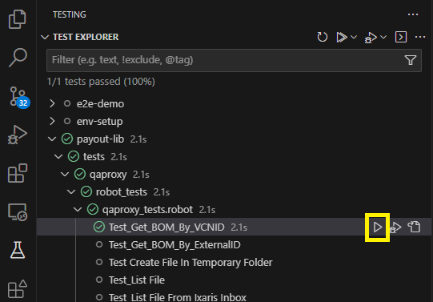
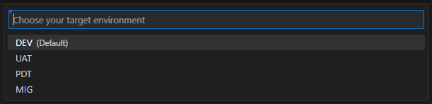
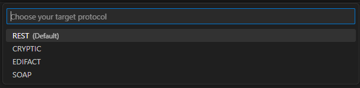

# Robot Framework Testing for Payout

## ***Environment setup***
**1. Create a python virtual environment :** 
`python -m venv .venv`
 
**2. Intall the framework in your virtual env using the requirements file :** 
`pip install -r requirements.txt`

> **protocols-lib** : library to handle different types of protocols to inject traffic (cryptic, edifact, rest, soap)
> 
> **cyberark-lib** : library to manage CyberArk connection to retrieve secrets
> 
> **pnr-lib** : library to handle PNR functionalities
> 
> **payout-lib** : library to handle payout functionalities (virtual cards management, reporting, qaproxy, ...)

**3. Intall robot framework extension for VS Code:** 
- [Robot Framework Language Server](https://marketplace.visualstudio.com/items?itemName=robocorp.robotframework-lsp) 
- [Test Explorer UI](https://marketplace.visualstudio.com/items?itemName=hbenl.vscode-test-explorer)

**4. Configure the setting.json file in your .vscode folder :** 
```
{
    // for MacOS/Linux
    //"robot.language-server.python": "${workspaceFolder}/.venv/bin/python3",
    // for Windows
    "robot.language-server.python": "${workspaceFolder}/.venv/Scripts/python.exe",
    "robot.pythonpath": [
        // for MacOS
        //"${workspaceFolder}/.venv/lib/python3.10/site-packages/",
        // for Windows
        "${workspaceFolder}/.venv/Lib/site-packages/",
        "${workspaceFolder}/resources/",
        "${workspaceFolder}/data/",
        "${workspaceFolder}/lib/"
    ],
    "python.languageServer": "Pylance"
}
```
**5. Configure the launch.json file in your .vscode folder (to easily run tests in VS Code) :** 
```
{
    "configurations": [
        {
            "type": "robotframework-lsp",
            "name": "Robot Framework: Launch Template",
            "request": "launch",
            "terminal": "integrated",
            "env": {
                    "ENVIRONMENT": "${input:env}",
                    "PROTOCOL": "${input:protocol}",
                    "DCX_HANDLING": "False",
                    "EDIFACT_GRAMMAR_DIRECTORY": "${workspaceFolder}/data/edifact_grammars/"
            },
            "args": [
                "--loglevel",
                "DEBUG",
                "--outputdir",             
                "${workspaceFolder}/reports"
            ]
        }
    ],
    "inputs": [
            {
                "id": "env",
                "type": "pickString",
                "description": "Choose your target environment",
                "options": ["DEV", "PDT", "UAT", "MIG"],
                "default": "DEV"
        },
        {
            "id": "protocol",
            "type": "pickString",
            "description": "Choose your target protocol",
            "options": ["CRYPTIC", "EDIFACT", "REST", "SOAP"],
            "default": "EDIFACT"
        },
    ]
}
```

## ***Run Tests***

### **Run your tests from VS Code test explorer**

1. **Run Test**



2. **Select the environment**



3. **Select the protocol**



## ***Keywords Documentation***

- [payout](https://static.forge.amadeus.net/utopy/payout-lib/payout-lib.html)
- [protocols](https://static.forge.amadeus.net/utopy/protocols-lib/protocols-lib.html)
- [pnr](https://static.forge.amadeus.net/utopy/pnr-lib/pnr-lib.html)
